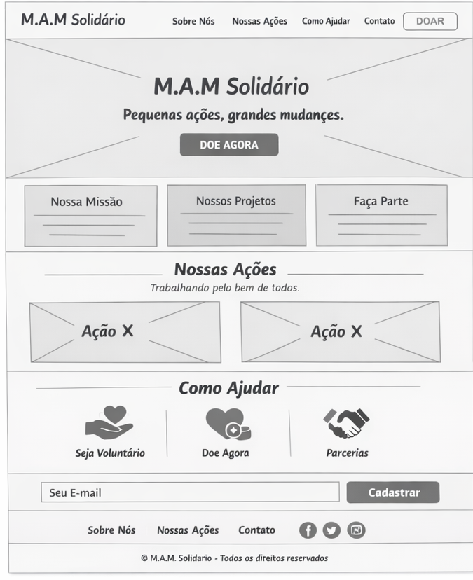
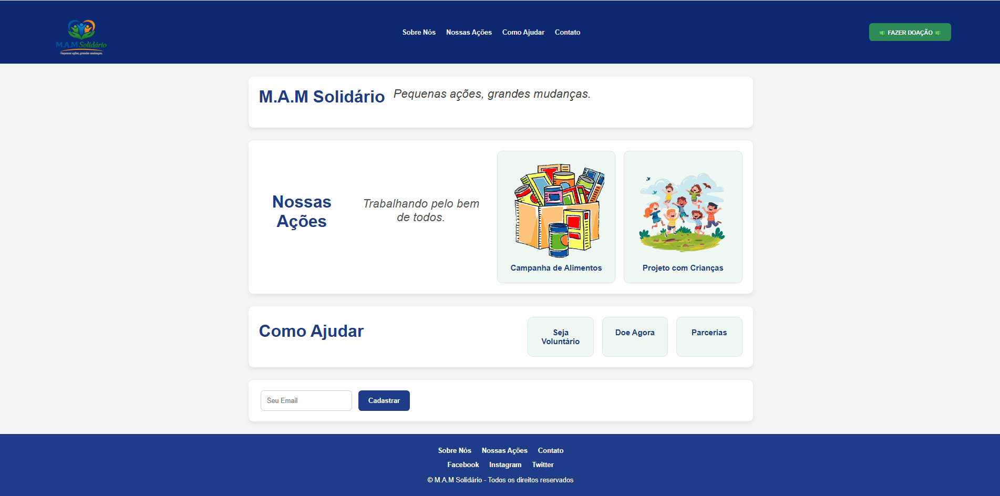

# Trabalho Prático - Semana 03

Dessa vez, vamos escolher uma proposta de projeto para trabalhar.

Nessa atividade, você deverá montar a página inicial do projeto escolhido, a organização do HTML aplicando semântica correta e uso aprimorado do CSS. Leia o enunciado completo no Canvas para mais detalhes.

**IMPORTANTE:** Você deve trabalhar e alterar apenas arquivos dentro da pasta **`public`**. Deixe todos os demais arquivos e pastas desse repositório inalterados. **PRESTE MUITA ATENÇÃO NISSO.**

## Informações Gerais

- Nome: Mateus Andrade Motta
- Matricula: 907005
- Proposta de projeto escolhida: Organizações e Equipes
- Breve descrição sobre seu projeto: O projeto M.A.M Solidário é um site desenvolvido com foco em apresentar uma ONG fictícia voltada para ações sociais e ajuda comunitária. A proposta da página é mostrar a missão da organização, seus projetos, formas de ajuda e meios de contato, incentivando a participação de voluntários e doadores.

## Print do(s) wireframe(s) criado

## Print da home-page criada

